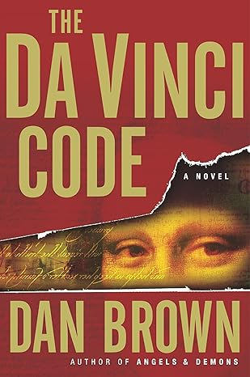
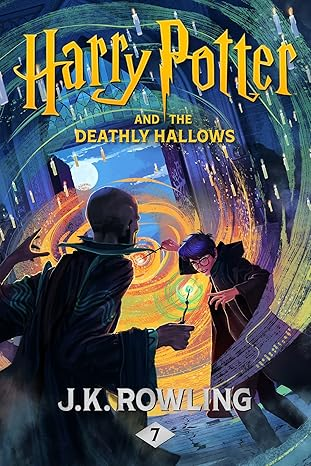
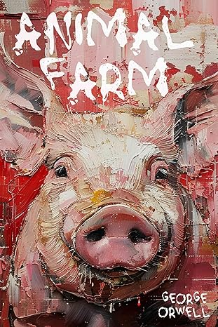
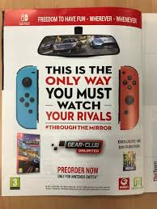

# Explorando os Recursos de IA Generativa com Copilot e OpenAI

Atividade com intuito de testar as capacidades de reconhecimento de texto do MS Copilot.

## The Da Vinci Code

    Aqui está o texto reconhecido da imagem:

    THE DA VINCI CODE A NOVEL DAN BROWN AUTHOR OF ANGELS & DEMONS

    Parece ser a capa do livro “O Código Da Vinci” de Dan Brown. Se precisar de mais alguma coisa, é só avisar! 📚

## Harry Potter

    Aqui está o texto reconhecido da imagem:

    Harry Potter and the Deathly Hallows J.K. Rowling

    Parece ser a capa do livro “Harry Potter e as Relíquias da Morte” de J.K. Rowling. Se precisar de mais alguma coisa, é só avisar! 📚

## Farm Animal

    Aqui está o texto reconhecido da imagem:

    ANIMAL FARM GEORGE ORWELL

    Parece ser a capa do livro “A Revolução dos Bichos” de George Orwell. Se precisar de mais alguma coisa, é só avisar! 📚

## Apple

    Claro! Aqui está o texto reconhecido da imagem:

    “Of the 235 million people in America, only a fraction can use a computer.”

    Parece ser uma propaganda antiga destacando a importância da alfabetização digital. Se precisar de mais alguma coisa, é só avisar! 😊

## Nintendo Switch

    Claro! Aqui está o texto reconhecido da imagem:

    FREEDOM TO HAVE FUN - WHEREVER - WHENEVER

    THIS IS THE ONLY WAY YOU MUST WATCH YOUR RIVALS #THROUGH THE MIRROR

    PREORDER NOW

    GEAR-CLUB

    Parece ser um anúncio de um acessório para o Nintendo Switch. Precisa de mais alguma informação sobre isso?
